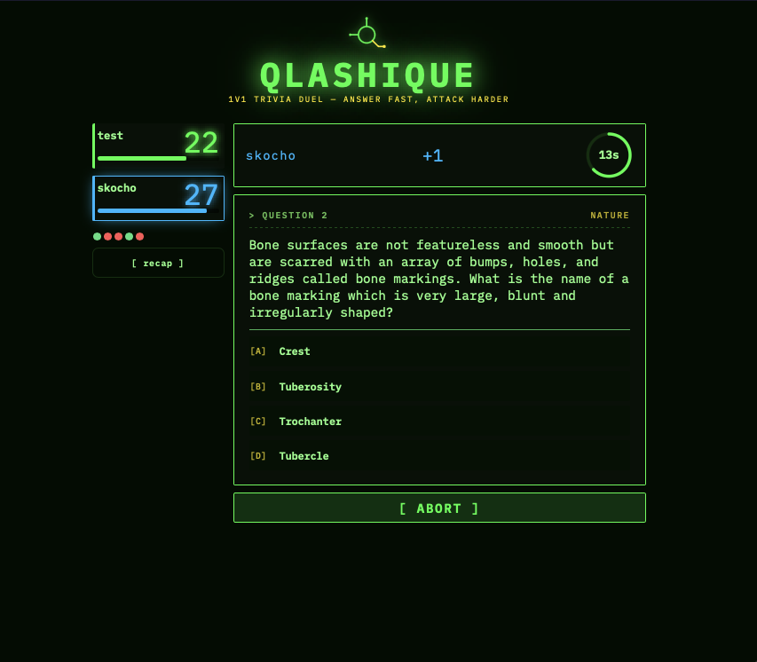
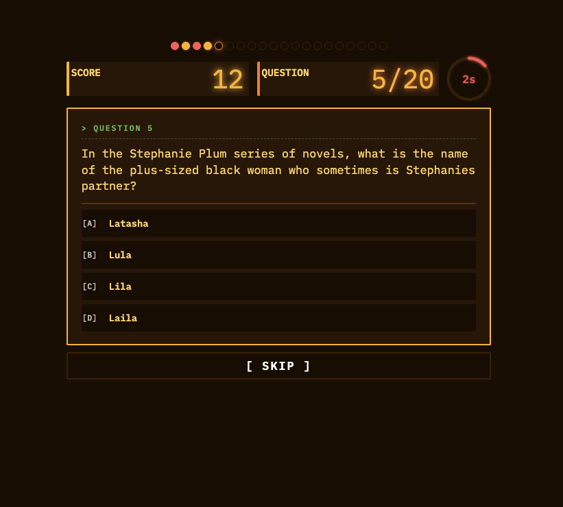

# Weeqlash Multiplayer

A multiplayer brawliseum whilst seeking for wisdom and knowledge.

To win some answers find you must!!!

Never overrandom, juxtaposers outh!!!

Play at **https://brawl.weeqlash.icu** — create an account or banish yourself to nothingness, learn your 0s.

## Getting In

- Open the site. The landing screen shows three mode cards: **Brawl**, **Qlashique**, and **SkipNoT**.
- **Register** an account (email + password) or **log in** from the top-left tabs. An account is needed to land on leaderboards; anonymous play works for casual rounds.
- To play with friends: whoever creates the game shares the **5-character room code** — the other side pastes it into the matching `Join game` box for that mode.

There are three modes. Pick your poison.

---

## 1. Weeqlash Brawl — the main event

Deploy your pegs across a board of knowledge tiles. Answer trivia. Crush your opponents with the sheer brute force of knowing things they don't. Every tile has a category. Every move demands an answer. Every wrong answer is a small gift you hand your enemy with both trembling hands.

### Setup

- **Board size**: 4×4, 5×5, 6×6, 7×7, 8×8 (default) or 10×10.
- **Question timer** (under `Settings`): 15 / 30 / 45 seconds per question.
- **Categories** (under `Settings`): toggle any subset of categories on or off before creating the room.
- Hit **Create game** → a 5-char room code appears in the lobby. Share it. Wait for humans.

### Turn Structure

Each turn grants you a **pool of 3 moves** — spend them however you like across your pegs. Advance, flank, sacrifice, overcorrect. The board doesn't care about your feelings.

- Move a peg to an adjacent tile → answer a question in that tile's category
- Answer correctly → hold the tile, keep the momentum, feel briefly invincible
- Answer wrong → move wasted, dignity optional

### Combat

Walk a peg onto an enemy-occupied tile and the gloves come off. You get up to **3 questions**.

- Each correct answer deals **1 HP damage** to the defender
- First miss ends the fight — your peg stays put, their peg keeps whatever HP it had left. Both parties go home disappointed
- Drain the defender to **0 HP** to eliminate them and claim their tile
- Combat always burns your remaining move tokens. Choose your battles

Each peg starts with **3 HP** and never heals. Lose all three and the peg is gone. Permanently. Pour one out.

### Capture the Flags

Four corners. Four flags. One throne.

- Flags appear on boards 5×5 and larger; each player gets one corner flag to defend
- Each corner flag needs **3 correct answers** to capture
- Capture any flag → you win, your legacy is secured, your enemies are invited to reflect

---

## 2. Qlashique — 1v1 trivia duel ⚔

A head-to-head knife fight over a single question queue. No board, no pegs, no mercy. Each duelist starts with **15 HP** (configurable: 10 / 15 / 20 / 30). First to 0 is dust.

### Before the bell

- Either player clicks **⚔ QLASHIQUE** to open a room and shares the code; the other pastes it into the `Qlashique` join input. Game starts as soon as both players are in.

### How a turn works

You get a batch of questions under a timer that **starts at 5 seconds and grows by 3 every round** (2 turns = 1 round, cap 25s). Your running **score** for the turn goes up +1 per correct answer and down −1 per miss. When you end the turn:

| Score | What happens                                                  |
| ----- | ------------------------------------------------------------- |
| `< 0` | **Self-damage** — you take `abs(score)` HP. Humbling.         |
| `= 0` | Nothing happens. Next duelist's turn.                         |
| `= 1` | **Automatic attack** for 1 damage.                            |
| `≥ 2` | **Choose**: `attack` (deal `score` damage) or `heal` (+2 HP). |

---

## 3. SkipNoT — solo 20-question gauntlet

_No opponents. No timer between questions. No mercy._

Twenty questions, twelve seconds each. Click an answer, click skip, or let the timer run out — the run keeps going. Your final score is what survives.

### Scoring

| Outcome        | Delta   |
| -------------- | ------- |
| Correct answer | **+13** |
| Wrong answer   | **−7**  |
| Skip           | **0**   |
| Timeout        | **0**   |

A perfect run is **+260**. A worst-case all-wrong run is **−140**. Skipping is free — use it when you don't know.

### What you'll see

- **Progress dots** at the top — 20 dots, one per question, color-coded by result (filled amber = correct, red = wrong, dimmed = skip / timeout, pulsing = current).
- **Streak** counter — pops up at 3+ consecutive correct answers, breaks (with a shake) on wrong / skip / timeout.
- **Timer ring** — amber → yellow at 4s → red-pulsing at 2s.
- **Game-over heatmap** — grid showing every question's result side by side, plus best streak of the run.

### Leaderboard

Top scores land under **DEM SLEEPLESS**. Visible from the landing screen via `Show SkipNoT Leaderboard`. Logged-in accounts get their name on the board; anonymous runs work but don't qualify.

---

## Screenshots

