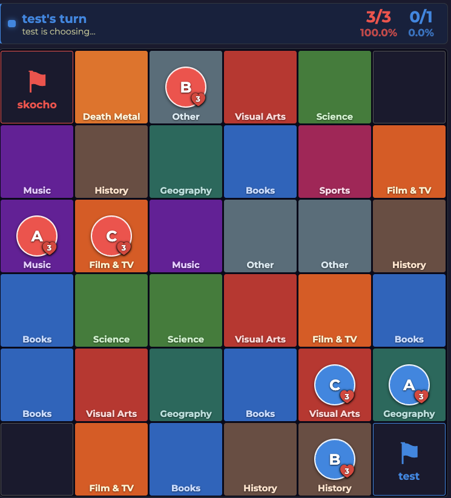
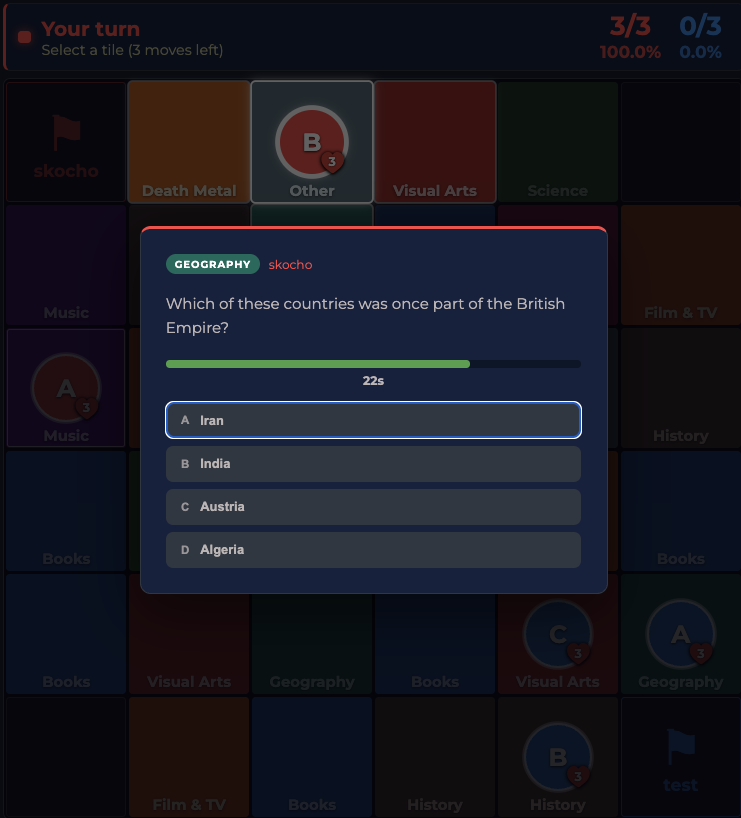
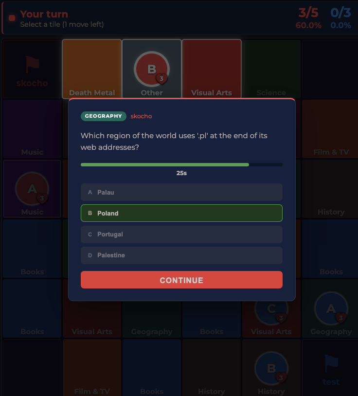

# Weeqlash Multiplayer

A multiplayer brawliseum whilst seeking for wisdom and knowledge.

To win some answers find you must!!!

Never overrandom, juxtaposers outh!!!

https://brawl.weeqlash.icu
Create an account or banish yourself to nothingness, learn your 0s.

## How to Play

Deploy your pegs across a board of knowledge tiles. Answer trivia. Crush your opponents with the sheer brute force of knowing things they don't. Every tile has a category. Every move demands an answer. Every wrong answer is a small gift you hand your enemy with both trembling hands.

### Turn Structure

Each turn grants you a **pool of 3 moves** — spend them however you like across your pegs. Advance, flank, sacrifice, overcorrect. The board doesn't care about your feelings.

- Move a peg to an adjacent tile → answer a question in that tile's category
- Answer correctly → hold the tile, keep the momentum, feel briefly invincible
- Answer wrong → move wasted, dignity optional

### Combat

Walk a peg onto an enemy-occupied tile and the gloves come off. You get up to **3 questions**.

- Each correct answer deals **1 HP damage** to the defender
- First miss ends the fight — your peg stays put, their peg keeps whatever HP it had left. Both parties go home disappointed
- Drain the defender to **0 HP** to eliminate them and claim their tile
- Combat always burns your remaining move tokens. Choose your battles

Each peg starts with **3 HP** and never heals. Lose all three and the peg is gone. Permanently. Pour one out.

### Capture the Flags

Four corners. Four flags. One throne.

- Each corner flag needs **3 correct answers** to capture
- Capture all four → you win, your legacy is secured, your enemies are invited to reflect

---

## Triviandom

_No opponents? No problem. Just you, your clicking finger, and the void._

Triviandom is the single-player arena for those who have no one to blame but themselves. Answer as many questions as you can, as fast as you can. Your score and your time both go on the board — under **DEM QWIZZACKS**, where the real ones live.

Hunt for that second digit. You know the one.

## Screenshots

