# Weeqlash Multiplayer

A multiplayer brawliseum whilst seeking for wisdom and knowledge.

To win some answers find you must!!!

Never overrandom, juxtaposers outh!!!

Play at **https://brawl.weeqlash.icu** — create an account or banish yourself to nothingness, learn your 0s.

## Getting In

- Open the site. The landing screen shows the mode cards: **Brawl**, **Qlashique**, **Qlashword**, **SkipNoT**, **HowHigh**, **CentoGrapher**, and **MathQ**.
- **Register** an account (email + password) or **log in** from the top-left tabs. An account is needed to land on leaderboards; anonymous play works for casual rounds.
- To play with friends: whoever creates the game shares the **5-character room code** — the other side pastes it into the matching `Join game` box for that mode.

Pick your poison.

---

## 1. Weeqlash Brawl — the main event

Deploy your pegs across a board of knowledge tiles. Answer trivia. Crush your opponents with the sheer brute force of knowing things they don't. Every tile has a category. Every move demands an answer. Every wrong answer is a small gift you hand your enemy with both trembling hands.

### Setup

- **Board size**: 4×4 (default), 5×5, 6×6, 7×7, 8×8 or 10×10.
- **Question timer** (under `Settings`): 15 / 30 / 45 seconds per question.
- **Categories** (under `Settings`): toggle any subset of categories on or off before creating the room.
- Hit **Create game** → a 5-char room code appears in the lobby. Share it. Wait for humans.

### Turn Structure

Each turn grants you a **pool of 3 moves** — spend them however you like across your pegs. Advance, flank, sacrifice, overcorrect. The board doesn't care about your feelings.

- Move a peg to an adjacent tile → answer a question in that tile's category
- Answer correctly → hold the tile, keep the momentum, feel briefly invincible
- Answer wrong → move wasted, dignity optional

### Combat

Walk a peg onto an enemy-occupied tile and the gloves come off. You get up to **3 questions**.

- Each correct answer deals **1 HP damage** to the defender
- First miss ends the fight — your peg stays put, their peg keeps whatever HP it had left. Both parties go home disappointed
- Drain the defender to **0 HP** to eliminate them and claim their tile
- Combat always burns your remaining move tokens. Choose your battles

Each peg starts with **3 HP** and never heals. Lose all three and the peg is gone. Permanently. Pour one out.

### Capture the Flag

Each player's starting corner is their flag. On boards 5×5 and larger, reach an opponent's flag corner and answer 3 questions correctly to capture it. Capture any flag and you win.

---

## 2. Qlashique — 1v1 trivia duel ⚔

A head-to-head knife fight over a single question queue. No board, no pegs, no mercy. Each duelist starts with **15 HP** (configurable: 10 / 15 / 20 / 30). First to 0 is dust.

### Before the bell

- Either player clicks **⚔ QLASHIQUE** to open a room and shares the code; the other pastes it into the `Qlashique` join input. Game starts as soon as both players are in.

### How a turn works

You get a batch of questions under a timer that **starts at 5 seconds and grows by 3 every round** (2 turns = 1 round, cap 25s). Your running **score** for the turn goes up +1 per correct answer and down −1 per miss. When you end the turn:

| Score | What happens                                                  |
| ----- | ------------------------------------------------------------- |
| `< 0` | **Self-damage** — you take `abs(score)` HP. Humbling.         |
| `= 0` | Nothing happens. Next duelist's turn.                         |
| `= 1` | **Automatic attack** for 1 damage.                            |
| `≥ 2` | **Choose**: `attack` (deal `score` damage) or `heal` (+2 HP). |

---

## 3. SkipNoT — solo 20-question gauntlet

_No opponents. No timer between questions. No mercy._

Twenty questions, twelve seconds each. Click an answer, click skip, or let the timer run out — the run keeps going. Your final score is what survives.

### Scoring

| Outcome        | Delta   |
| -------------- | ------- |
| Correct answer | **+13** |
| Wrong answer   | **−7**  |
| Skip           | **0**   |
| Timeout        | **0**   |

A perfect run is **+260**. A worst-case all-wrong run is **−140**. Skipping is free — use it when you don't know.

### What you'll see

- **Progress dots** at the top — 20 dots, one per question, color-coded by result (filled amber = correct, red = wrong, dimmed = skip / timeout, pulsing = current).
- **Streak** counter — pops up at 3+ consecutive correct answers, breaks (with a shake) on wrong / skip / timeout.
- **Timer ring** — amber → yellow at 4s → red-pulsing at 2s.
- **Game-over heatmap** — grid showing every question's result side by side, plus best streak of the run.

### Leaderboard

Top scores land under **DEM SLEEPLESS**. Visible from the landing screen via `Show SkipNoT Leaderboard`. Logged-in accounts get their name on the board; anonymous runs work but don't qualify.

---

## 4. HowHigh — async challenge mode

Ten questions, thirteen seconds each. Play solo, get a 5-character challenge code, share it. Your opponent plays the same ten questions whenever they feel like it — no need to be online at the same time.

### Scoring

| Outcome | Delta |
| ------- | ----- |
| Correct | +2    |
| Wrong   | −2    |

### Bonuses

After question 3 the game offers one of these (accept or decline, your funeral either way):

| Bonus             | What happens                                      |
| ----------------- | ------------------------------------------------- |
| Dice              | Roll two dice. Q4 is worth die1 + die2 if correct |
| Double or Nothing | Q4 and Q5 pay double (+4 correct, −4 wrong)       |

After question 6, another offer:

| Bonus       | What happens                                                        |
| ----------- | ------------------------------------------------------------------- |
| GoWild      | 2 extra questions (12 total), timer drops to 10 seconds, same +2/−2 |
| Time Crunch | Q7 and Q8 get a 7-second timer, +3/−3 each                          |

### Head-to-head

Both players finish, scores get compared. Ties broken by speed. Results show up in the HowHigh tab. Unmatched challenges (waiting for an opponent) appear at the top with a copyable code.

---

## 5. Qlashword — Scrabble with a knowledge tax

1v1 Scrabble, except the premium squares don't give anything away for free. The double and triple letter/word tiles sit there locked. Cover one with your tiles and the game stops to ask you a trivia question. Answer it and the multiplier counts. Miss it and your word still scores, just at face value.

### Before the bell

- One player clicks **Qlashword** to open a room and shares the 5-char code; the other pastes it into the `Qlashword` join box. The host hits **START** once both are in.

### A turn

- Standard 15×15 board, 100 tiles, normal letter values. You hold 7.
- Drag or tap tiles from your rack onto the board to build a word. The first word of the game crosses the centre; after that you build off what's already down.
- Every word you make has to be real, and the crossing words count too. A bad word bounces the whole play back.
- Hit **SUBMIT**. For each premium square your new tiles covered, you answer one question (random category, no Death Metal). Right, the multiplier unlocks for the turn. Wrong or timed out, you keep the base points and nothing more.
- 90 seconds a turn or it auto-passes. **PASS** if you've got nothing, **SWAP** to dump tiles back in the bag (burns your turn), **SHUFFLE** to reorder your rack. All 7 tiles in one play is a +50 bingo.

Bag empties, someone clears their rack, leftover tile values get subtracted, highest score wins.

---

## 6. CentoGrapher — one map, sixty traps

Solo geography. We show you the outline of a country, just the shape with no name on it, and a grid of 60 things: cities, rivers, mountains, clubs, famous people, border claims, a few bare numbers, the occasional cartoon character that wandered in. Some belong to that country. Most don't. Tick every one that fits.

You don't get told how many are right. Could be eight, could be twenty-five, and it shifts every run and per category, so there's no pattern to lean on, no "the cities are always correct" shortcut. The wrong answers aren't filler either. Next to Germany you'll find Austrian and Swiss towns, Polish football clubs, false borders, numbers that look about right. Stuff you actually have to know to wave off.

### Scoring

| Outcome      | Delta  |
| ------------ | ------ |
| Correct pick | **+5** |
| Wrong pick   | **−8** |

Capped at +100. No floor, so a trigger-happy run drops below zero and sits there. Sixty seconds on the clock, and it submits itself when the time's up. At the end only the choices you ticked light up green or red. The ones you left alone stay dark, so the game never just shows you the full answer.

---

## 7. MathQ — solo numbers, no options to hide behind

Ten problems, forty-five seconds each, and you type the answer instead of picking from a list. Calculus, geometry, trig, limits, the odd graph to read off. None of it comes from a question bank: every problem is generated fresh for the run, so memorising won't save you.

You don't have to nail it exactly. Land inside the tolerance and you get full marks; drift further out and the points fall off bit by bit; miss by a mile and it's zero. A few of the problems hand out a small bonus when you get really close, which helps on the estimate-this-square-root kind. Each question is worth 10 to start.

The answer never shows up, not mid-round and not on the review screen at the end. All you get back is whether each one was right, partial, or wrong, and what it earned you.

---

## Stats

The **Stats** button shows a logged-in player:

- how many games they played
- how many games they won
- the correct answers percentage for each question category

---

## Screenshots

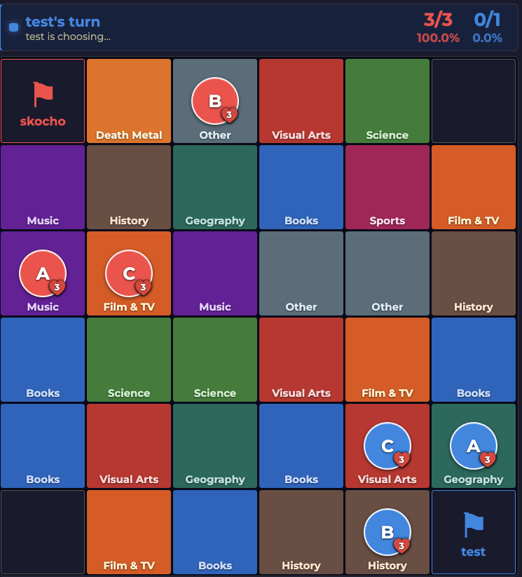
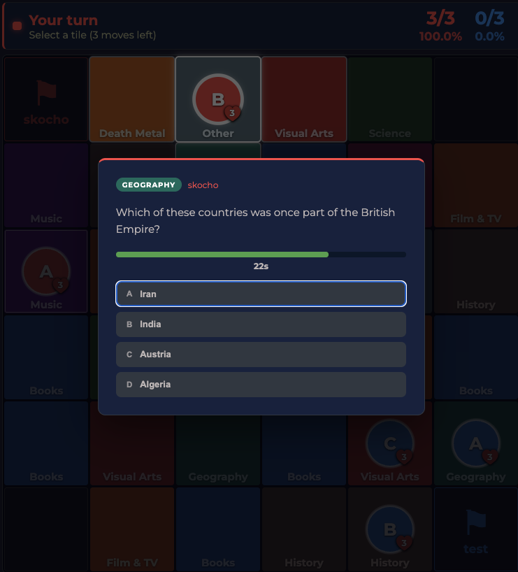
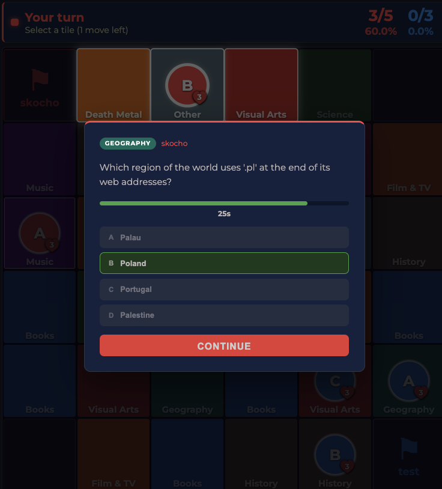
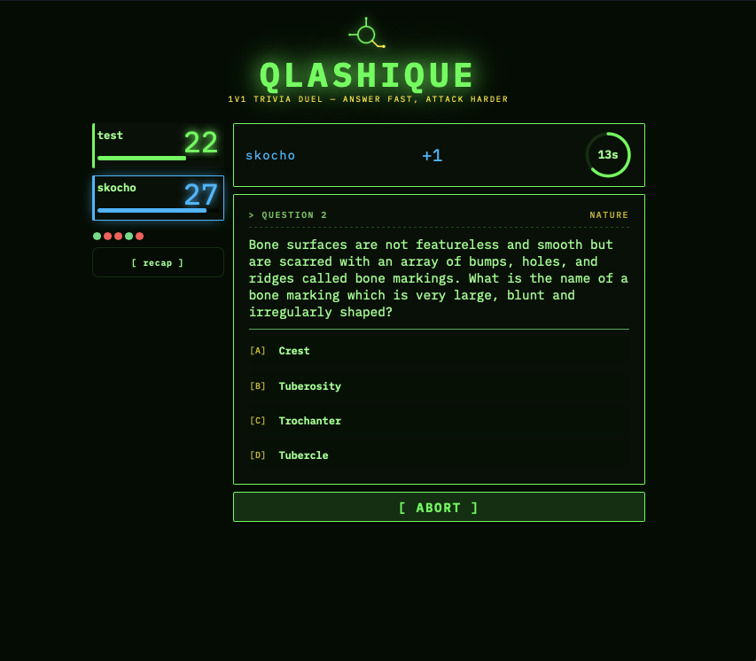
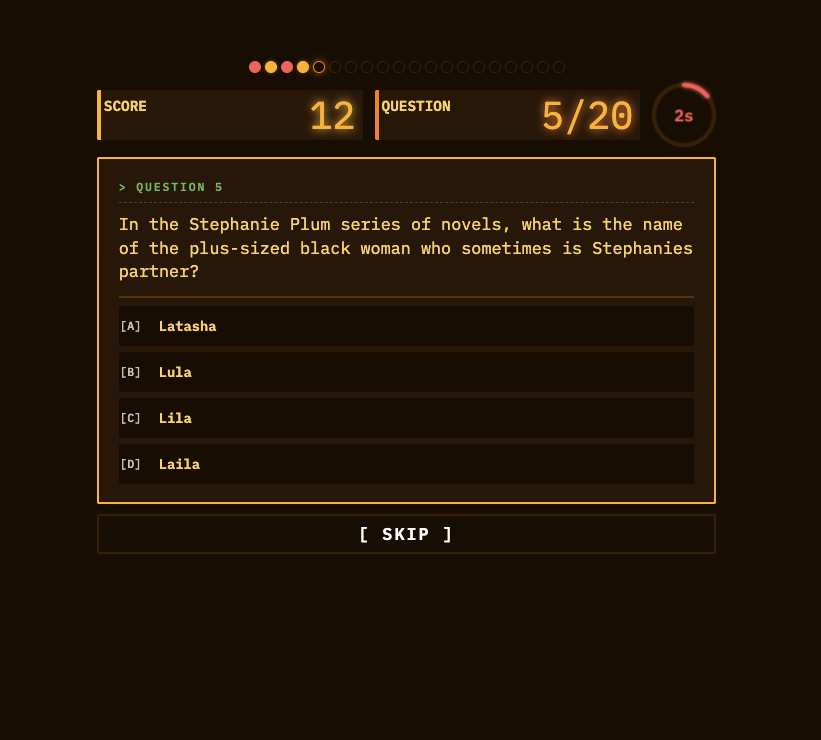
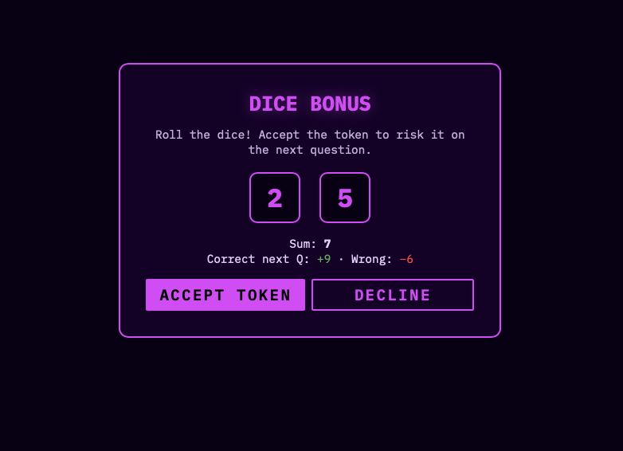
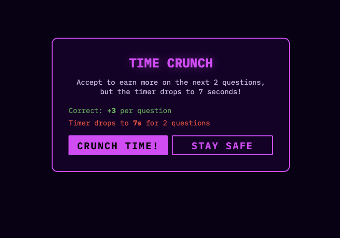
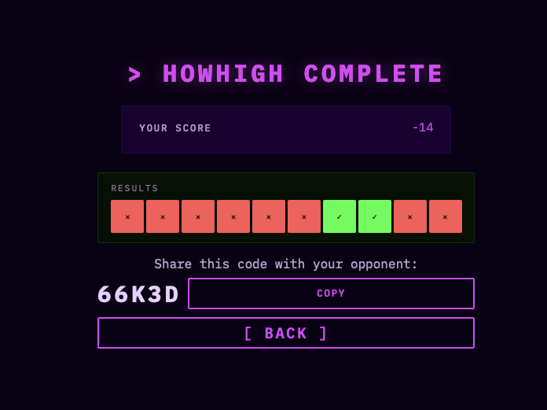
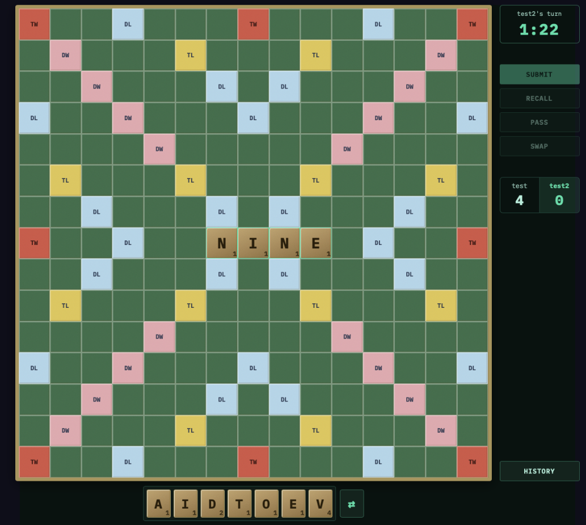
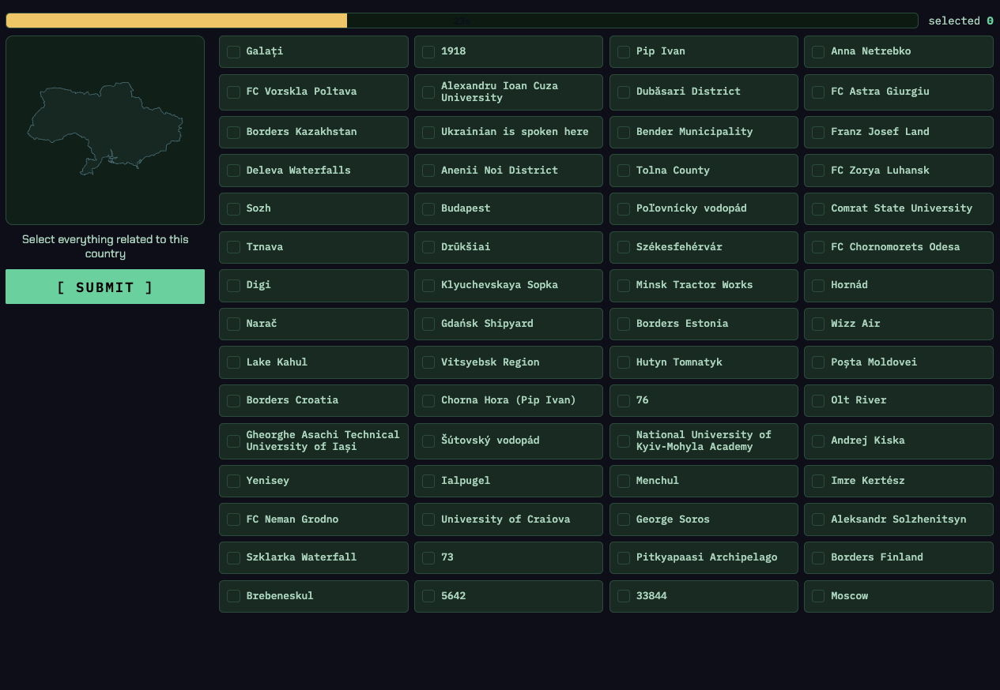
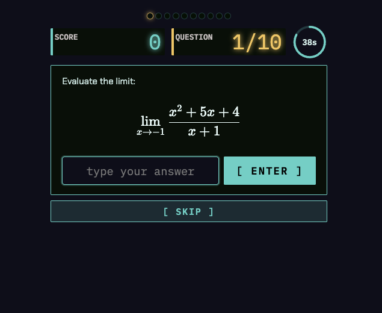
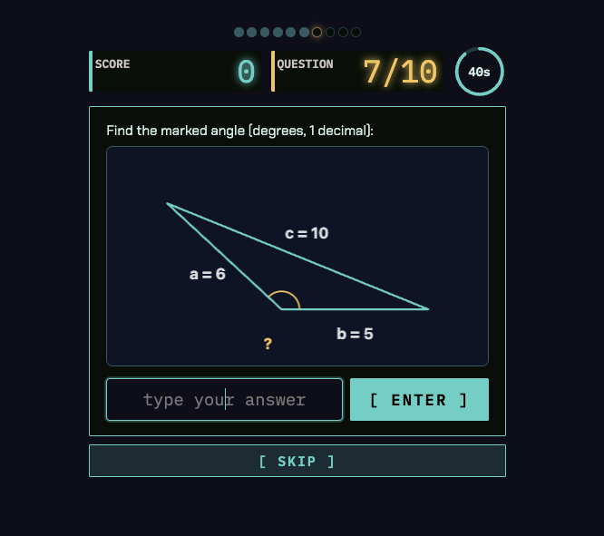
